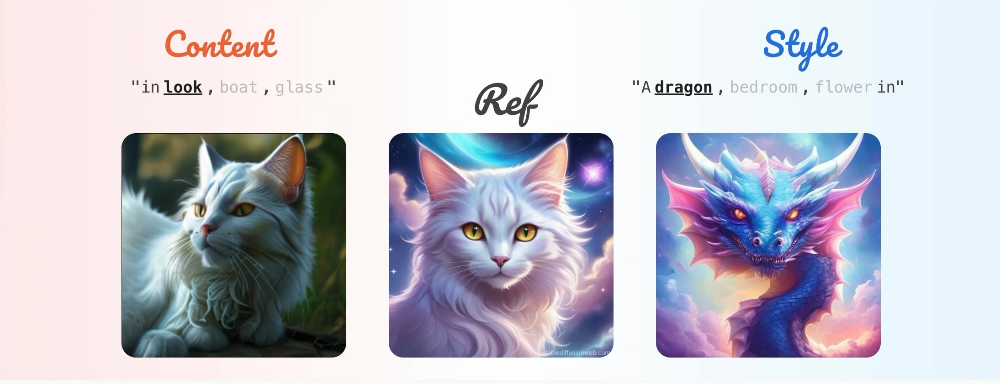

# CSD-VAR: Content-Style Decomposition in Visual Autoregressive Models ✨ (ICCV 2025)

[](https://arxiv.org/abs/2507.13984)
[](https://huggingface.co/papers/2507.13984)
[](https://huggingface.co/datasets/qualcomm/csd100)

**PyTorch implementation** of ICCV 2025 paper:
**"CSD-VAR: Content-Style Decomposition in Visual Autoregressive Models"**

**Team:** [Quang-Binh Nguyen](https://nqbinhcs.github.io/), [Minh Luu](https://minhluu2911.github.io/), [Quang Nguyen](https://quang-ngh.github.io/), [Anh Tran](https://scholar.google.com/citations?user=FYZ5ODQAAAAJ&hl=en), [Khoi Nguyen](https://www.khoinguyen.org/)

### Status

- [x] Release code, training & inference for CSD-VAR (Switti)
- [ ] Release code, training & inference for CSD-VAR (Infinity-2B)



> **Abstract**:
Disentangling content and style from a single image, known as content-style decomposition (CSD), enables recontextualization of extracted content and stylization of extracted styles, offering greater creative flexibility in visual synthesis. While recent personalization methods have explored the decomposition of explicit content style, they remain tailored for diffusion models. Meanwhile, Visual Autoregressive Modeling (VAR) has emerged as a promising alternative with a next-scale prediction paradigm, achieving performance comparable to that of diffusion models. In this paper, we explore VAR as a generative framework for CSD, leveraging its scale-wise generation process for improved disentanglement. To this end, we propose CSD-VAR, a novel method that introduces three key innovations: (1) a scale-aware alternating optimization strategy that aligns content and style representation with their respective scales to enhance separation, (2) an SVD-based rectification method to mitigate content leakage into style representations, and (3) an Augmented Key-Value (K-V) memory enhancing content identity preservation. To benchmark this task, we introduce CSD-100, a dataset specifically designed for content-style decomposition, featuring diverse subjects rendered in various artistic styles. Experiments demonstrate that CSD-VAR outperforms prior approaches, achieving superior content preservation and stylization fidelity.

---

## 🚀 Getting Started

### Environment Setup ⚙️

1. **Create and activate conda environment:**
   ```bash
   conda create -n csd-var python=3.10
   conda activate csd-var
   ```

2. **Install PyTorch:**
   
   **For CUDA 11.8:**
   ```bash
   pip install torch==2.3.1 torchvision==0.18.1 torchaudio==2.3.1 --index-url https://download.pytorch.org/whl/cu118
   ```
   
   **For CUDA 12.1 or higher:**
   ```bash
   pip install torch==2.3.1 torchvision==0.18.1 torchaudio==2.3.1 --index-url https://download.pytorch.org/whl/cu121
   ```

3. **Install required packages:**
   ```bash
   pip install -r requirements.txt
   ```

4. **Install CSD Metric Assessment**

- Download the `pytorch_model.bin` file from [this link](https://huggingface.co/tomg-group-umd/CSD-ViT-L/blob/main/pytorch_model.bin) to the following directory: `evaluator/CSD/csd_models/pytorch_model.bin`
   ```bash
   curl --create-dirs -L "https://huggingface.co/tomg-group-umd/CSD-ViT-L/blob/main/pytorch_model.bin" -o "$PWD/evaluator/CSD/csd_models/pytorch_model.bin"
   ```
- Install the CSD package:
   ```bash
   pip install -e evaluator/CSD
   ```

### Data Preparation 🗂️

Before running the benchmark, you need to prepare the necessary data:

1. **For quick testing (recommended for first-time users):**
   ```bash
   python extract_svd.py --input_dir_data benchmark_data/toy_examples
   ```

2. **For full benchmark evaluation:** First populate each example’s reference image `imgs/00.jpg` from the Hugging Face release (the archive layout is `test/<content>+<style>/00.jpg`, matching `benchmark_data/test`). Run the following **from the repository root** (requires `bash`, `curl`, and `unzip`):

   ```bash
   set -euo pipefail
   BENCHMARK="benchmark_data"
   ZIP_URL="https://huggingface.co/datasets/qualcomm/csd100/resolve/main/csd100_flux_schnell.zip"
   ZIP="${BENCHMARK}/csd100_flux_schnell.zip"
   STAGE="${BENCHMARK}/.csd100_flux_schnell_extract"

   curl -fL --progress-bar -o "${ZIP}" "${ZIP_URL}"
   rm -rf "${STAGE}"
   mkdir -p "${STAGE}"
   unzip -q "${ZIP}" -d "${STAGE}"

   shopt -s nullglob
   for dir in "${STAGE}/test/"*/; do
     name="$(basename "${dir}")"
     mkdir -p "${BENCHMARK}/test/${name}/imgs"
     mv -f "${dir}00.jpg" "${BENCHMARK}/test/${name}/imgs/00.jpg"
   done
   shopt -u nullglob

   rm -rf "${STAGE}" "${ZIP}"
   ```

   Then extract SVD features for the benchmark split:

   ```bash
   python extract_svd.py --input_dir_data benchmark_data/test
   ```

3. **For custom examples:** Ensure you follow our exact format structure:
   ```
   <content>+<style>/
   ├── imgs/
   │   └── 00.jpg
   ├── captions.csv          # prompts for finetuning
   └── variation_content.txt # content variations for projection matrix
   ```
   
   **Note:** This is an inversion-based technique that requires initializing prior `<content>` and `<style>` tokens. The prompt should describe the desired disentanglement concept generally.
   
   **💡 Tip:** Start with `benchmark_data/toy_examples` for quick testing, then switch to `benchmark_data/test` for full benchmark results.

### Training & Inference ▶️

Once the environment is set up, you can run the training code on toy examples in `scripts/run_toy_examples.sh`. Additionally, we also provide the script for running all benchmark data in `scripts/run_benchmark.sh`.

### Evaluation 📊

To compute scores on generated images, use `evaluate_with_metrics.py`:

```bash
OUTPUT_EVAL_DIR="output/toy_examples_test"  # specify the path to the output directory to evaluate
python evaluate_with_metrics.py --result_dir "$OUTPUT_EVAL_DIR" --data_dir "$TRAIN_DATA_DIR"
```

**Note:** A summary file will be generated at `$OUTPUT_EVAL_DIR/summary_metrics.csv` containing the evaluation metrics.

---

## 📚 Citation

```bibtex
@InProceedings{Nguyen_2025_ICCV,
    author    = {Nguyen, Quang-Binh and Luu, Minh and Nguyen, Quang and Tran, Anh and Nguyen, Khoi},
    title     = {CSD-VAR: Content-Style Decomposition in Visual Autoregressive Models},
    booktitle = {Proceedings of the IEEE/CVF International Conference on Computer Vision (ICCV)},
    month     = {October},
    year      = {2025},
    pages     = {17013-17023}
}
```


